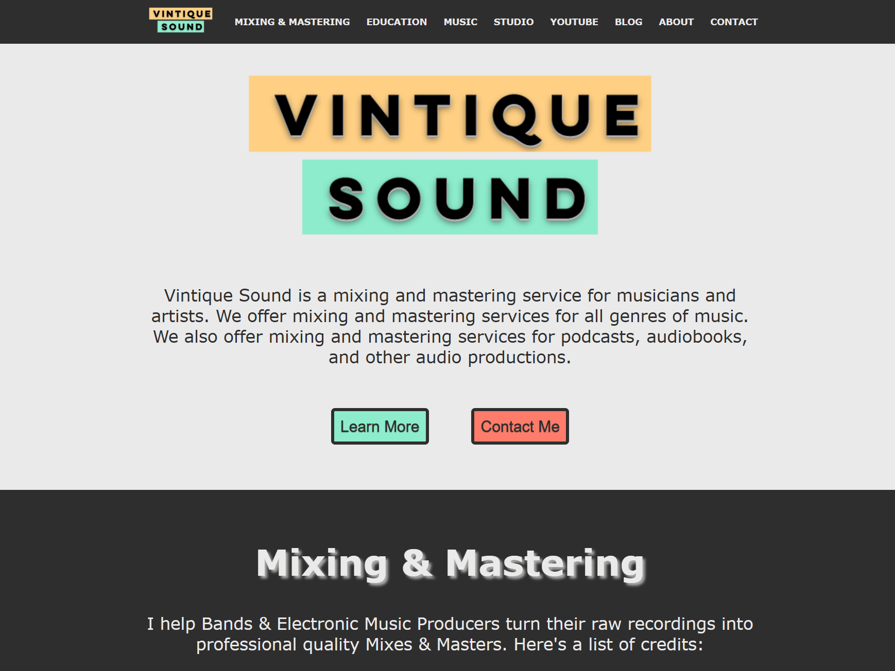
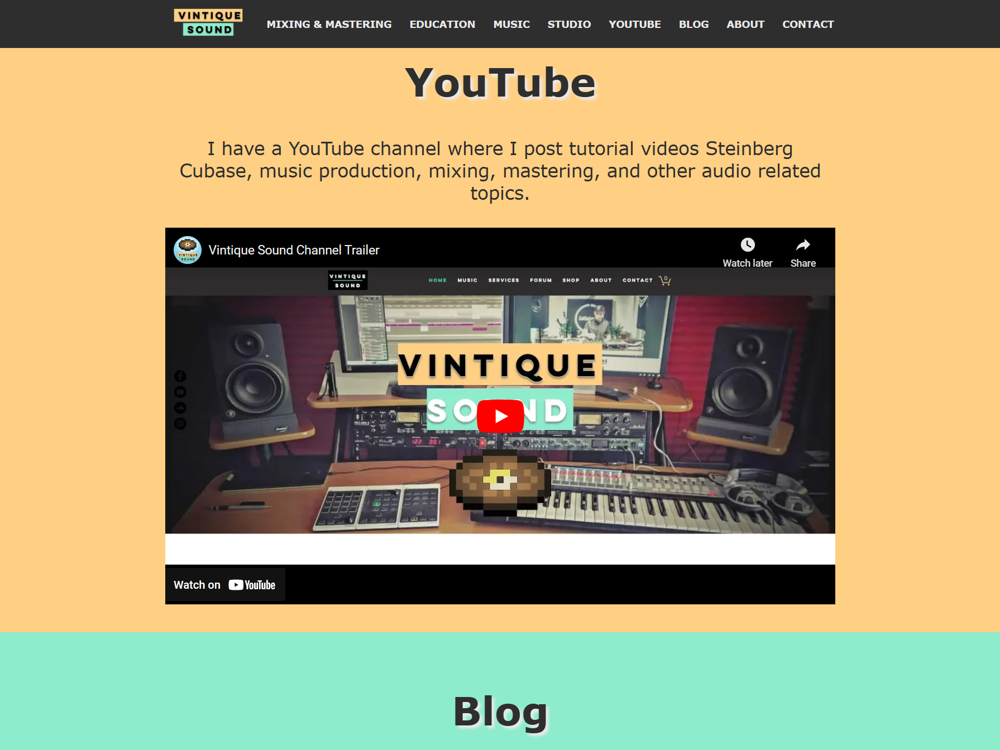
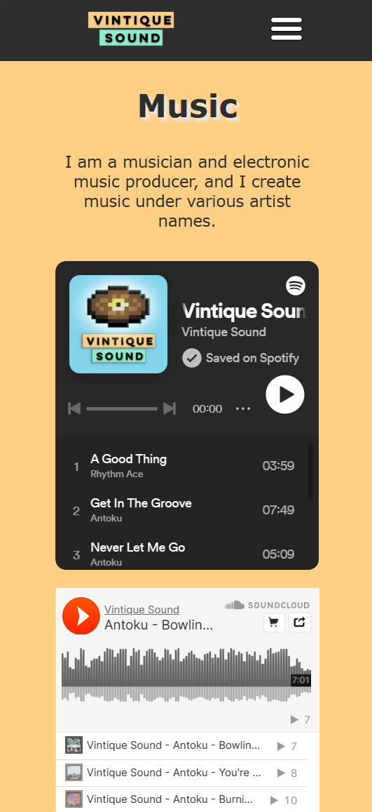

# Readme
This is a simple HTML/CSS/Javascript based website that will be used as a template for my music business "Vintique Sound."

## Desktop Preview
</img>

</img>

## Mobile Preview

</img>

## Further Developments
More development will be done to make the website more complete.
- Every section will become its own page, with more information and details.
- The website will also be hosted with a custom domain name.
- I'll be adding a store page where I'll be selling my services and various digital products.

## How to compile SASS .scss files to .css
- Run ``npm run build:css`` to build once.
- Run ``npm run watch:css`` to watch for changes.
